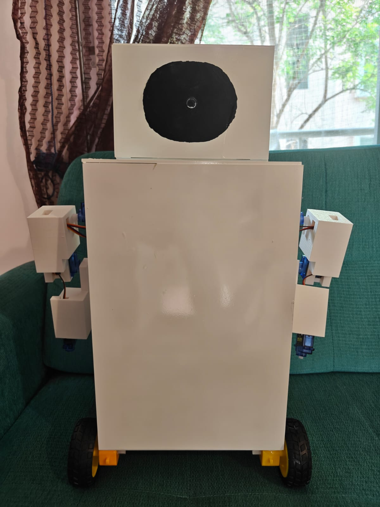
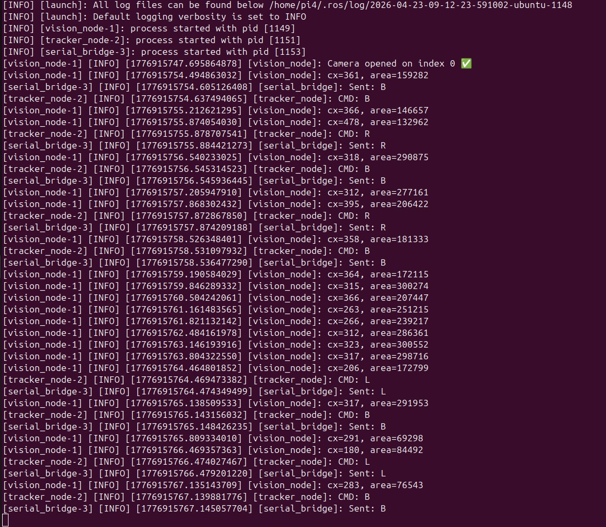

# humanoid-edge-ai-human-tracking-robot
Humanoid-inspired autonomous robot using Edge AI, ROS2, Raspberry Pi, ESP32, and YOLOv8 for real-time human detection and tracking.

# 🤖 Humanoid Robot Using Edge AI for Real-Time Human Detection and Tracking

## 📷 Project Prototype

## 🎯 Human Detection Output

## 📌 Overview

This project presents a humanoid-inspired autonomous robot capable of detecting and tracking a person in real time using Edge AI.

The system combines computer vision, embedded systems, and robotics to create an intelligent robot that can autonomously follow a human target while maintaining a safe distance.

The robot uses a Raspberry Pi 4 for vision processing and an ESP32 for motor control. A YOLOv8 ONNX model performs real-time human detection through a USB camera, while ROS2 Humble provides modular communication between system components.

---

## 🎯 Objectives

- Real-time human detection using YOLOv8
- Autonomous human tracking
- Edge AI deployment on Raspberry Pi
- ROS2-based modular architecture
- ESP32 motor control
- Safe distance maintenance
- Real-time serial communication

---

## 🏗️ System Architecture

USB Camera
↓
Vision Node (YOLOv8 ONNX)
↓
Tracker Node
↓
Serial Bridge
↓
ESP32
↓
L298N Motor Drivers
↓
4 DC Motors

---

## ⚙️ Hardware Components

| Component | Purpose |
|------------|------------|
| Raspberry Pi 4 | Edge AI Processing |
| ESP32 | Motor Controller |
| USB Camera | Human Detection |
| L298N Motor Drivers | Motor Control |
| DC Motors | Locomotion |
| Battery Pack | Power Supply |

---

## 💻 Software Stack

- Ubuntu 22.04
- ROS2 Humble
- Python
- OpenCV
- YOLOv8 ONNX
- NumPy
- PySerial

---

## 🔄 Working Principle

1. USB camera captures live video.
2. YOLOv8 ONNX detects a person.
3. Bounding box center and area are extracted.
4. Tracking node determines movement.
5. Commands are sent to ESP32.
6. ESP32 controls motors.
7. Robot follows the target autonomously.

---

## 📊 Results

- Successful real-time human detection
- Autonomous human tracking
- Stable Raspberry Pi ↔ ESP32 communication
- Smooth navigation
- Safe stopping mechanism

---

## 🏆 Key Achievements

- Developed a complete ROS2-based autonomous tracking robot.
- Integrated Raspberry Pi and ESP32 through serial communication.
- Implemented real-time human detection using YOLOv8 ONNX.
- Demonstrated autonomous human following using Edge AI.

---

## 🚀 Future Enhancements

- Voice Control
- AI Chatbot Integration
- PID Based Smooth Tracking
- Obstacle Avoidance
- Multi-Person Tracking
- SLAM Navigation

---

## 🌍 Sustainable Development Goals (SDGs)

### SDG 3 – Good Health and Well-being
Assistive robotic systems for elderly and disabled individuals.

### SDG 9 – Industry, Innovation and Infrastructure
Promotes innovation through Edge AI and robotics.

### SDG 11 – Sustainable Cities and Communities
Supports smart surveillance and intelligent automation.

---

## 👨‍💻 Authors

**S. Sai Giri Charan**
- Electronics and Communication Engineering
- Dayananda Sagar University

**Rohan Krishnan Susarla**
- Electronics and Communication Engineering
- Dayananda Sagar University
